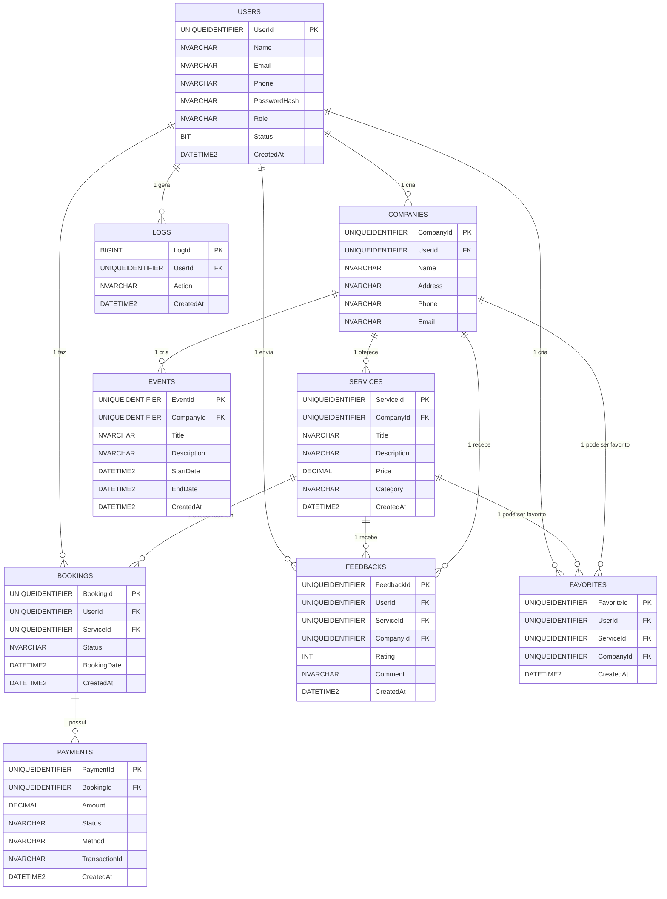

### 🎯 Objetivo

Centralizar e organizar todas as informações necessárias para o funcionamento do sistema de turismo interativo, garantindo **escalabilidade**, **segurança** e **performance**.

---

## SQL Script

```sql
-- ========================
-- Tabelas de Usuários e Acesso
-- ========================
CREATE TABLE Users (
    UserId UNIQUEIDENTIFIER PRIMARY KEY DEFAULT NEWID(),
    Name NVARCHAR(100) NOT NULL,
    Email NVARCHAR(150) UNIQUE NOT NULL,
    Phone NVARCHAR(20) NULL,
    PasswordHash NVARCHAR(255) NOT NULL,
    Role NVARCHAR(50) NOT NULL, -- admin, company, tourist
    Status BIT DEFAULT 1, -- ativo/inativo
    CreatedAt DATETIME2 DEFAULT SYSDATETIME()
);
-- **Uso:** Armazena turistas, administradores e empresas para login, perfis e controle de acesso.

-- ========================
-- Empresas (Parceiros)
-- ========================
CREATE TABLE Companies (
    CompanyId UNIQUEIDENTIFIER PRIMARY KEY DEFAULT NEWID(),
    UserId UNIQUEIDENTIFIER NOT NULL,
    Name NVARCHAR(150) NOT NULL,
    Address NVARCHAR(255) NOT NULL,
    Phone NVARCHAR(20) NULL,
    Email NVARCHAR(150) NULL,
    FOREIGN KEY (UserId) REFERENCES Users(UserId)
);
-- **Uso:** Cadastro das empresas que oferecem serviços turísticos; vinculadas a usuários administradores.

-- ========================
-- Serviços Oferecidos
-- ========================
CREATE TABLE Services (
    ServiceId UNIQUEIDENTIFIER PRIMARY KEY DEFAULT NEWID(),
    CompanyId UNIQUEIDENTIFIER NOT NULL,
    Title NVARCHAR(150) NOT NULL,
    Description NVARCHAR(MAX) NULL,
    Price DECIMAL(10,2) NOT NULL,
    Category NVARCHAR(100) NOT NULL,
    CreatedAt DATETIME2 DEFAULT SYSDATETIME(),
    FOREIGN KEY (CompanyId) REFERENCES Companies(CompanyId)
);
-- **Uso:** Serviços oferecidos por empresas (passeios, restaurantes, atividades), com preços e categorias.

-- ========================
-- Reservas / Agendamentos
-- ========================
CREATE TABLE Bookings (
    BookingId UNIQUEIDENTIFIER PRIMARY KEY DEFAULT NEWID(),
    UserId UNIQUEIDENTIFIER NOT NULL,
    ServiceId UNIQUEIDENTIFIER NOT NULL,
    Status NVARCHAR(50) NOT NULL DEFAULT 'pending', -- pending, confirmed, cancelled
    BookingDate DATETIME2 NOT NULL,
    CreatedAt DATETIME2 DEFAULT SYSDATETIME(),
    FOREIGN KEY (UserId) REFERENCES Users(UserId),
    FOREIGN KEY (ServiceId) REFERENCES Services(ServiceId)
);
-- **Uso:** Controle das reservas feitas pelos turistas, vinculando usuário e serviço, com status.

-- ========================
-- Pagamentos
-- ========================
CREATE TABLE Payments (
    PaymentId UNIQUEIDENTIFIER PRIMARY KEY DEFAULT NEWID(),
    BookingId UNIQUEIDENTIFIER NOT NULL,
    Amount DECIMAL(10,2) NOT NULL,
    Status NVARCHAR(50) NOT NULL DEFAULT 'pending', -- pending, paid, failed, refunded
    Method NVARCHAR(50) NOT NULL, -- ex: abacate_pay, pix, card
    TransactionId NVARCHAR(100) NULL,
    CreatedAt DATETIME2 DEFAULT SYSDATETIME(),
    FOREIGN KEY (BookingId) REFERENCES Bookings(BookingId)
);
-- **Uso:** Registro de transações financeiras realizadas via AbacatePay ou outro método; vinculado a reservas.

-- ========================
-- Painel / Logs de Acesso
-- ========================
CREATE TABLE Logs (
    LogId BIGINT IDENTITY(1,1) PRIMARY KEY,
    UserId UNIQUEIDENTIFIER NOT NULL,
    Action NVARCHAR(255) NOT NULL,
    CreatedAt DATETIME2 DEFAULT SYSDATETIME(),
    FOREIGN KEY (UserId) REFERENCES Users(UserId)
);
-- **Uso:** Auditoria do sistema; registra ações importantes dos usuários para rastreabilidade.

-- ========================
-- Feedback / Turismo
-- ========================
CREATE TABLE Feedbacks (
    FeedbackId UNIQUEIDENTIFIER PRIMARY KEY DEFAULT NEWID(),
    UserId UNIQUEIDENTIFIER NOT NULL,
    ServiceId UNIQUEIDENTIFIER NULL,
    CompanyId UNIQUEIDENTIFIER NULL,
    Rating INT NOT NULL, -- 1 a 5
    Comment NVARCHAR(MAX) NULL,
    CreatedAt DATETIME2 DEFAULT SYSDATETIME(),
    FOREIGN KEY (UserId) REFERENCES Users(UserId),
    FOREIGN KEY (ServiceId) REFERENCES Services(ServiceId),
    FOREIGN KEY (CompanyId) REFERENCES Companies(CompanyId)
);
-- **Uso:** mostrar avaliações no painel do turista e da empresa, gerar relatórios de satisfação.

-- ========================
-- Favoritos
-- ========================
CREATE TABLE Favorites (
    FavoriteId UNIQUEIDENTIFIER PRIMARY KEY DEFAULT NEWID(),
    UserId UNIQUEIDENTIFIER NOT NULL,
    ServiceId UNIQUEIDENTIFIER NULL,
    CompanyId UNIQUEIDENTIFIER NULL,
    CreatedAt DATETIME2 DEFAULT SYSDATETIME(),
    FOREIGN KEY (UserId) REFERENCES Users(UserId),
    FOREIGN KEY (ServiceId) REFERENCES Services(ServiceId),
    FOREIGN KEY (CompanyId) REFERENCES Companies(CompanyId)
);
-- **Uso:** mostrar uma lista personalizada de serviços favoritos para o turista.

-- ========================
-- Eventos
-- ========================
CREATE TABLE Events (
    EventId UNIQUEIDENTIFIER PRIMARY KEY DEFAULT NEWID(),
    CompanyId UNIQUEIDENTIFIER NOT NULL,
    Title NVARCHAR(150) NOT NULL,
    Description NVARCHAR(MAX) NULL,
    StartDate DATETIME2 NOT NULL,
    EndDate DATETIME2 NOT NULL,
    CreatedAt DATETIME2 DEFAULT SYSDATETIME(),
    FOREIGN KEY (CompanyId) REFERENCES Companies(CompanyId)
);
-- **Uso:** mostrar no painel do turista eventos ativos, reservas de ingressos, promoções etc.

-- ========================
-- Mensagens entre usuários e empresas
-- ========================
CREATE TABLE Messages (
    MessageId UNIQUEIDENTIFIER PRIMARY KEY DEFAULT NEWID(),
    SenderId UNIQUEIDENTIFIER NOT NULL,  -- Usuário que envia
    ReceiverId UNIQUEIDENTIFIER NOT NULL, -- Usuário/Empresa que recebe
    BookingId UNIQUEIDENTIFIER NULL,      -- Opcional, vinculado a reserva
    Content NVARCHAR(MAX) NOT NULL,
    IsRead BIT DEFAULT 0,
    CreatedAt DATETIME2 DEFAULT SYSDATETIME(),
    FOREIGN KEY (SenderId) REFERENCES Users(UserId),
    FOREIGN KEY (ReceiverId) REFERENCES Users(UserId),
    FOREIGN KEY (BookingId) REFERENCES Bookings(BookingId)
);

-- ========================
-- Notificações automáticas do sistema
-- ========================
CREATE TABLE Notifications (
    NotificationId UNIQUEIDENTIFIER PRIMARY KEY DEFAULT NEWID(),
    UserId UNIQUEIDENTIFIER NOT NULL,
    Title NVARCHAR(150) NOT NULL,
    Content NVARCHAR(MAX) NOT NULL,
    Type NVARCHAR(50) NOT NULL, -- info, warning, success
    IsRead BIT DEFAULT 0,
    CreatedAt DATETIME2 DEFAULT SYSDATETIME(),
    FOREIGN KEY (UserId) REFERENCES Users(UserId)
);


```

---



- **USERS** → turistas, empresas (admins de empresa) e admins gerais.
    
- **COMPANIES** → vinculadas a usuários do tipo empresa.
    
- **SERVICES** → oferecidos por empresas.
    
- **BOOKINGS** → ligam usuários e serviços.
    
- **PAYMENTS** → vinculados a reservas.
    
- **LOGS** → histórico de ações dos usuários.
    
- **FEEDBACKS** → avaliações de usuários sobre serviços ou empresas.
    
- **FAVORITES** → lista personalizada de serviços/empresas de usuários.
    
- **EVENTS** → eventos criados por empresas.