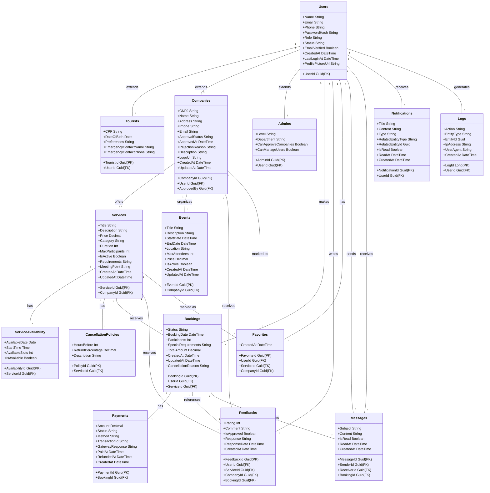

### 🎯 Objetivo

Centralizar e organizar todas as informações necessárias para o funcionamento do sistema de turismo interativo, garantindo **escalabilidade**, **segurança** e **performance**.

---

## SQL Script

```sql
-- ========================
-- Tabela de Usuários (Simplificada mas expansível)
-- ========================
CREATE TABLE Users (
    UserId UNIQUEIDENTIFIER PRIMARY KEY DEFAULT NEWID(),
    Name NVARCHAR(100) NOT NULL,
    Email NVARCHAR(150) UNIQUE NOT NULL,
    PasswordHash NVARCHAR(255) NOT NULL,
    Role NVARCHAR(20) NOT NULL CHECK (Role IN ('tourist', 'company', 'admin')),
    Status NVARCHAR(20) DEFAULT 'active' CHECK (Status IN ('active', 'inactive')),
    CreatedAt DATETIME2 DEFAULT SYSDATETIME(),
    -- Campos para expansão futura
    ProfileData NVARCHAR(MAX) NULL -- Armazena JSON com dados adicionais
);

-- ========================
-- Tabela de Empresas (Simplificada)
-- ========================
CREATE TABLE Companies (
    CompanyId UNIQUEIDENTIFIER PRIMARY KEY DEFAULT NEWID(),
    UserId UNIQUEIDENTIFIER NOT NULL UNIQUE,
    CNPJ CHAR(14) NOT NULL UNIQUE,
    CompanyName NVARCHAR(150) NOT NULL,
    ApprovalStatus NVARCHAR(20) DEFAULT 'pending' CHECK (ApprovalStatus IN ('pending', 'approved', 'rejected')),
    -- Campos para expansão futura
    CompanyData NVARCHAR(MAX) NULL, -- Armazena JSON com dados adicionais
    FOREIGN KEY (UserId) REFERENCES Users(UserId) ON DELETE CASCADE
);

-- ========================
-- Tabela de Serviços/Eventos (Simplificada)
-- ========================
CREATE TABLE Services (
    ServiceId UNIQUEIDENTIFIER PRIMARY KEY DEFAULT NEWID(),
    CompanyId UNIQUEIDENTIFIER NOT NULL,
    Title NVARCHAR(150) NOT NULL,
    Description NVARCHAR(500) NULL,
    Price DECIMAL(10,2) NOT NULL,
    Category NVARCHAR(100) NOT NULL,
    StartDate DATETIME2 NOT NULL,
    EndDate DATETIME2 NULL,
    MaxParticipants INT NULL,
    IsActive BIT DEFAULT 1,
    CreatedAt DATETIME2 DEFAULT SYSDATETIME(),
    -- Campos para expansão futura
    ServiceData NVARCHAR(MAX) NULL, -- Armazena JSON com dados adicionais
    FOREIGN KEY (CompanyId) REFERENCES Companies(CompanyId) ON DELETE CASCADE
);

-- ========================
-- Tabela de Reservas (Simplificada)
-- ========================
CREATE TABLE Bookings (
    BookingId UNIQUEIDENTIFIER PRIMARY KEY DEFAULT NEWID(),
    UserId UNIQUEIDENTIFIER NOT NULL,
    ServiceId UNIQUEIDENTIFIER NOT NULL,
    Status NVARCHAR(20) NOT NULL DEFAULT 'pending' CHECK (Status IN ('pending', 'confirmed', 'cancelled', 'completed')),
    BookingDate DATETIME2 NOT NULL,
    Participants INT DEFAULT 1,
    TotalAmount DECIMAL(10,2) NOT NULL,
    CreatedAt DATETIME2 DEFAULT SYSDATETIME(),
    -- Campos para expansão futura
    BookingData NVARCHAR(MAX) NULL, -- Armazena JSON com dados adicionais
    FOREIGN KEY (UserId) REFERENCES Users(UserId),
    FOREIGN KEY (ServiceId) REFERENCES Services(ServiceId)
);

-- ========================
-- Tabela de Pagamentos (Simplificada)
-- ========================
CREATE TABLE Payments (
    PaymentId UNIQUEIDENTIFIER PRIMARY KEY DEFAULT NEWID(),
    BookingId UNIQUEIDENTIFIER NOT NULL UNIQUE,
    Amount DECIMAL(10,2) NOT NULL,
    Status NVARCHAR(20) NOT NULL DEFAULT 'pending' CHECK (Status IN ('pending', 'paid', 'failed', 'refunded')),
    Method NVARCHAR(20) NOT NULL CHECK (Method IN ('pix', 'credit_card', 'debit_card')),
    CreatedAt DATETIME2 DEFAULT SYSDATETIME(),
    -- Campos para expansão futura
    PaymentData NVARCHAR(MAX) NULL, -- Armazena JSON com dados adicionais
    FOREIGN KEY (BookingId) REFERENCES Bookings(BookingId)
);

-- ========================
-- Tabela de Avaliações (Simplificada)
-- ========================
CREATE TABLE Reviews (
    ReviewId UNIQUEIDENTIFIER PRIMARY KEY DEFAULT NEWID(),
    UserId UNIQUEIDENTIFIER NOT NULL,
    ServiceId UNIQUEIDENTIFIER NOT NULL,
    BookingId UNIQUEIDENTIFIER NULL,
    Rating INT NOT NULL CHECK (Rating BETWEEN 1 AND 5),
    Comment NVARCHAR(500) NULL,
    CreatedAt DATETIME2 DEFAULT SYSDATETIME(),
    FOREIGN KEY (UserId) REFERENCES Users(UserId),
    FOREIGN KEY (ServiceId) REFERENCES Services(ServiceId),
    FOREIGN KEY (BookingId) REFERENCES Bookings(BookingId)
);

-- ========================
-- Índices para melhor performance
-- ========================
CREATE INDEX IX_Users_Email ON Users(Email);
CREATE INDEX IX_Users_Role ON Users(Role);
CREATE INDEX IX_Companies_UserId ON Companies(UserId);
CREATE INDEX IX_Companies_ApprovalStatus ON Companies(ApprovalStatus);
CREATE INDEX IX_Services_CompanyId ON Services(CompanyId);
CREATE INDEX IX_Services_StartDate ON Services(StartDate);
CREATE INDEX IX_Bookings_UserId ON Bookings(UserId);
CREATE INDEX IX_Bookings_ServiceId ON Bookings(ServiceId);
CREATE INDEX IX_Bookings_Status ON Bookings(Status);
CREATE INDEX IX_Payments_BookingId ON Payments(BookingId);
CREATE INDEX IX_Payments_Status ON Payments(Status);
CREATE INDEX IX_Reviews_ServiceId ON Reviews(ServiceId);
```

---



- **USERS** → turistas, empresas (admins de empresa) e admins gerais.
    
- **COMPANIES** → vinculadas a usuários do tipo empresa.
    
- **SERVICES** → oferecidos por empresas.
    
- **BOOKINGS** → ligam usuários e serviços.
    
- **PAYMENTS** → vinculados a reservas.
    
- **LOGS** → histórico de ações dos usuários.
    
- **FEEDBACKS** → avaliações de usuários sobre serviços ou empresas.
    
- **FAVORITES** → lista personalizada de serviços/empresas de usuários.
    
- **EVENTS** → eventos criados por empresas.