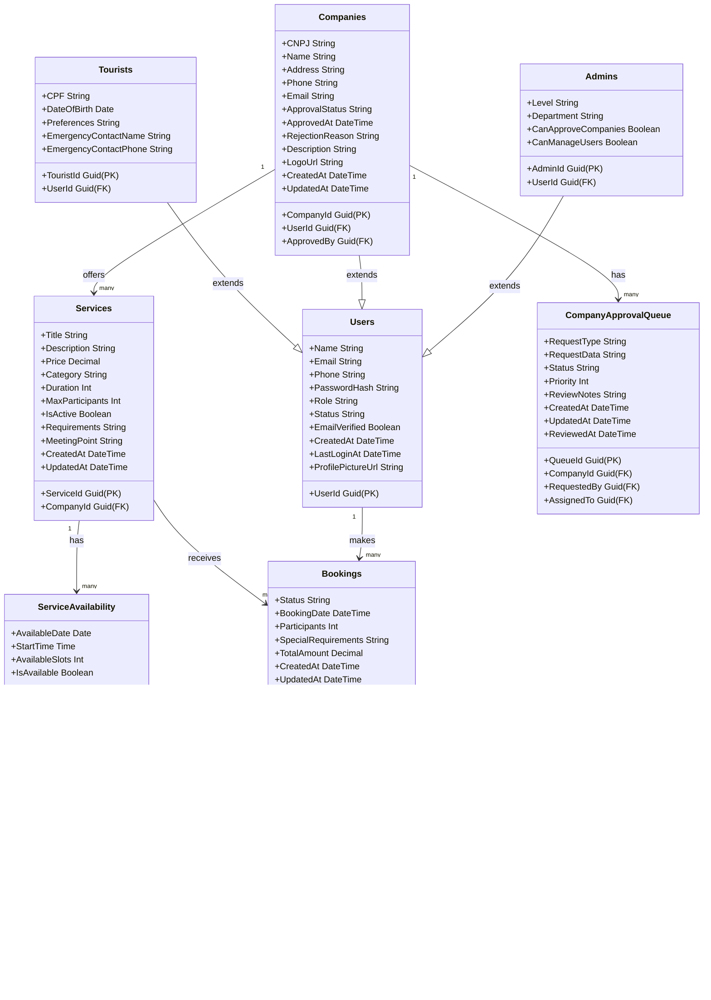

### 🎯 Objetivo

Centralizar e organizar todas as informações necessárias para o funcionamento do sistema de turismo interativo, garantindo **escalabilidade**, **segurança** e **performance**.

---

## SQL Script

```sql
-- ========================
-- Tabela de Usuários
-- ========================
CREATE TABLE Users (
       UserId UNIQUEIDENTIFIER PRIMARY KEY DEFAULT NEWID(),
       Name NVARCHAR(100) NOT NULL,
       Email NVARCHAR(150) UNIQUE NOT NULL,
       Phone NVARCHAR(20) NULL,
       PasswordHash NVARCHAR(255) NOT NULL,
       Role NVARCHAR(20) NOT NULL CHECK (Role IN ('tourist', 'company', 'admin')),
       Status NVARCHAR(20) DEFAULT 'active' CHECK (Status IN ('active', 'inactive', 'suspended')),
       EmailVerified BIT DEFAULT 0,
       CreatedAt DATETIME2 DEFAULT SYSDATETIME(),
       LastLoginAt DATETIME2 NULL,
       ProfilePictureUrl NVARCHAR(255) NULL
);

-- ========================
-- Tabela de Turistas
-- ========================
CREATE TABLE Tourists (
      TouristId UNIQUEIDENTIFIER PRIMARY KEY DEFAULT NEWID(),
      UserId UNIQUEIDENTIFIER NOT NULL UNIQUE,
      CPF CHAR(11) NOT NULL UNIQUE,
      DateOfBirth DATE NOT NULL,
      Preferences NVARCHAR(MAX) NULL,
      EmergencyContactName NVARCHAR(100) NULL,
      EmergencyContactPhone NVARCHAR(20) NULL,
      FOREIGN KEY (UserId) REFERENCES Users(UserId) ON DELETE CASCADE
);

-- ========================
-- Tabela de Empresas
-- ========================
CREATE TABLE Companies (
       CompanyId UNIQUEIDENTIFIER PRIMARY KEY DEFAULT NEWID(),
       UserId UNIQUEIDENTIFIER NOT NULL UNIQUE,
       CNPJ CHAR(14) NOT NULL UNIQUE,
       Name NVARCHAR(150) NOT NULL,
       Address NVARCHAR(255) NULL,
       Phone NVARCHAR(20) NULL,
       Email NVARCHAR(150) NULL,
       ApprovalStatus NVARCHAR(20) DEFAULT 'pending' CHECK (ApprovalStatus IN ('pending', 'approved', 'rejected')),
       ApprovedBy UNIQUEIDENTIFIER NULL,
       ApprovedAt DATETIME2 NULL,
       RejectionReason NVARCHAR(500) NULL,
       Description NVARCHAR(500) NULL,
       LogoUrl NVARCHAR(255) NULL,
       CreatedAt DATETIME2 DEFAULT SYSDATETIME(),
       UpdatedAt DATETIME2 DEFAULT SYSDATETIME(),
       FOREIGN KEY (UserId) REFERENCES Users(UserId) ON DELETE CASCADE,
       FOREIGN KEY (ApprovedBy) REFERENCES Users(UserId)
);

-- ========================
-- Tabela de Administradores
-- ========================
CREATE TABLE Admins (
    AdminId UNIQUEIDENTIFIER PRIMARY KEY DEFAULT NEWID(),
    UserId UNIQUEIDENTIFIER NOT NULL UNIQUE,
    Level NVARCHAR(20) NOT NULL DEFAULT 'moderator' CHECK (Level IN ('moderator', 'superadmin')),
    Department NVARCHAR(50) NULL,
    CanApproveCompanies BIT DEFAULT 0,
    CanManageUsers BIT DEFAULT 0,
    FOREIGN KEY (UserId) REFERENCES Users(UserId) ON DELETE CASCADE
);

-- ========================
-- Tabela de Serviços
-- ========================
CREATE TABLE Services (
      ServiceId UNIQUEIDENTIFIER PRIMARY KEY DEFAULT NEWID(),
      CompanyId UNIQUEIDENTIFIER NOT NULL,
      Title NVARCHAR(150) NOT NULL,
      Description NVARCHAR(500) NULL,
      Price DECIMAL(10,2) NOT NULL,
      Category NVARCHAR(100) NOT NULL,
      Duration INT NULL,
      MaxParticipants INT NULL,
      IsActive BIT DEFAULT 1,
      Requirements NVARCHAR(500) NULL,
      MeetingPoint NVARCHAR(255) NULL,
      CreatedAt DATETIME2 DEFAULT SYSDATETIME(),
      UpdatedAt DATETIME2 DEFAULT SYSDATETIME(),
      FOREIGN KEY (CompanyId) REFERENCES Companies(CompanyId) ON DELETE CASCADE
);

-- ========================
-- Tabela de Disponibilidade de Serviços
-- ========================
CREATE TABLE ServiceAvailability (
     AvailabilityId UNIQUEIDENTIFIER PRIMARY KEY DEFAULT NEWID(),
     ServiceId UNIQUEIDENTIFIER NOT NULL,
     AvailableDate DATE NOT NULL,
     StartTime TIME NOT NULL,
     AvailableSlots INT NOT NULL,
     IsAvailable BIT DEFAULT 1,
     FOREIGN KEY (ServiceId) REFERENCES Services(ServiceId) ON DELETE CASCADE
);

-- ========================
-- Tabela de Reservas
-- ========================
CREATE TABLE Bookings (
      BookingId UNIQUEIDENTIFIER PRIMARY KEY DEFAULT NEWID(),
      UserId UNIQUEIDENTIFIER NOT NULL,
      ServiceId UNIQUEIDENTIFIER NOT NULL,
      Status NVARCHAR(20) NOT NULL DEFAULT 'pending' CHECK (Status IN ('pending', 'confirmed', 'cancelled', 'completed')),
      BookingDate DATETIME2 NOT NULL,
      Participants INT DEFAULT 1,
      SpecialRequirements NVARCHAR(500) NULL,
      TotalAmount DECIMAL(10,2) NOT NULL,
      CreatedAt DATETIME2 DEFAULT SYSDATETIME(),
      UpdatedAt DATETIME2 DEFAULT SYSDATETIME(),
      CancellationReason NVARCHAR(500) NULL,
      FOREIGN KEY (UserId) REFERENCES Users(UserId),
      FOREIGN KEY (ServiceId) REFERENCES Services(ServiceId)
);

-- ========================
-- Tabela de Pagamentos
-- ========================
CREATE TABLE Payments (
      PaymentId UNIQUEIDENTIFIER PRIMARY KEY DEFAULT NEWID(),
      BookingId UNIQUEIDENTIFIER NOT NULL UNIQUE,
      Amount DECIMAL(10,2) NOT NULL,
      Status NVARCHAR(20) NOT NULL DEFAULT 'pending' CHECK (Status IN ('pending', 'paid', 'failed', 'refunded')),
      Method NVARCHAR(20) NOT NULL CHECK (Method IN ('pix', 'credit_card', 'debit_card')),
      TransactionId NVARCHAR(100) NULL,
      GatewayResponse NVARCHAR(MAX) NULL,
      PaidAt DATETIME2 NULL,
      RefundedAt DATETIME2 NULL,
      CreatedAt DATETIME2 DEFAULT SYSDATETIME(),
      FOREIGN KEY (BookingId) REFERENCES Bookings(BookingId)
);

-- ========================
-- Tabela de Avaliações
-- ========================
CREATE TABLE Reviews (
     ReviewId UNIQUEIDENTIFIER PRIMARY KEY DEFAULT NEWID(),
     UserId UNIQUEIDENTIFIER NOT NULL,
     ServiceId UNIQUEIDENTIFIER NOT NULL,
     BookingId UNIQUEIDENTIFIER NULL,
     Rating INT NOT NULL CHECK (Rating BETWEEN 1 AND 5),
     Comment NVARCHAR(500) NULL,
     IsApproved BIT DEFAULT 0,
     Response NVARCHAR(500) NULL,
     ResponseDate DATETIME2 NULL,
     CreatedAt DATETIME2 DEFAULT SYSDATETIME(),
     FOREIGN KEY (UserId) REFERENCES Users(UserId),
     FOREIGN KEY (ServiceId) REFERENCES Services(ServiceId),
     FOREIGN KEY (BookingId) REFERENCES Bookings(BookingId)
);

-- ========================
-- Tabela de Fila de Aprovação de Empresas
-- ========================
CREATE TABLE CompanyApprovalQueue (
      QueueId UNIQUEIDENTIFIER PRIMARY KEY DEFAULT NEWID(),
      CompanyId UNIQUEIDENTIFIER NOT NULL,
      RequestType NVARCHAR(20) NOT NULL CHECK (RequestType IN ('new_registration', 'data_update', 'status_change')),
      RequestedBy UNIQUEIDENTIFIER NOT NULL,
      RequestData NVARCHAR(MAX) NOT NULL,
      Status NVARCHAR(20) NOT NULL DEFAULT 'pending' CHECK (Status IN ('pending', 'under_review', 'approved', 'rejected')),
      Priority INT DEFAULT 1 CHECK (Priority BETWEEN 1 AND 5),
      AssignedTo UNIQUEIDENTIFIER NULL,
      ReviewNotes NVARCHAR(500) NULL,
      CreatedAt DATETIME2 DEFAULT SYSDATETIME(),
      UpdatedAt DATETIME2 DEFAULT SYSDATETIME(),
      ReviewedAt DATETIME2 NULL,
      FOREIGN KEY (CompanyId) REFERENCES Companies(CompanyId) ON DELETE CASCADE,
      FOREIGN KEY (RequestedBy) REFERENCES Users(UserId),
      FOREIGN KEY (AssignedTo) REFERENCES Users(UserId)
);

-- ========================
-- Índices para melhor performance
-- ========================
CREATE INDEX IX_Users_Email ON Users(Email);
CREATE INDEX IX_Users_Role ON Users(Role);
CREATE INDEX IX_Tourists_CPF ON Tourists(CPF);
CREATE INDEX IX_Companies_CNPJ ON Companies(CNPJ);
CREATE INDEX IX_Companies_ApprovalStatus ON Companies(ApprovalStatus);
CREATE INDEX IX_Services_CompanyId ON Services(CompanyId);
CREATE INDEX IX_Services_Category ON Services(Category);
CREATE INDEX IX_ServiceAvailability_ServiceId ON ServiceAvailability(ServiceId);
CREATE INDEX IX_Bookings_UserId ON Bookings(UserId);
CREATE INDEX IX_Bookings_ServiceId ON Bookings(ServiceId);
CREATE INDEX IX_Bookings_Status ON Bookings(Status);
CREATE INDEX IX_Payments_BookingId ON Payments(BookingId);
CREATE INDEX IX_Payments_Status ON Payments(Status);
CREATE INDEX IX_Reviews_ServiceId ON Reviews(ServiceId);
CREATE INDEX IX_Reviews_UserId ON Reviews(UserId);
CREATE INDEX IX_CompanyApprovalQueue_Status ON CompanyApprovalQueue(Status);
CREATE INDEX IX_CompanyApprovalQueue_CompanyId ON CompanyApprovalQueue(CompanyId);
```

---



- **USERS** → turistas, empresas (admins de empresa) e admins gerais.
    
- **COMPANIES** → vinculadas a usuários do tipo empresa.
    
- **SERVICES** → oferecidos por empresas.
    
- **BOOKINGS** → ligam usuários e serviços.
    
- **PAYMENTS** → vinculados a reservas.
    
- **LOGS** → histórico de ações dos usuários.
    
- **FEEDBACKS** → avaliações de usuários sobre serviços ou empresas.
    
- **FAVORITES** → lista personalizada de serviços/empresas de usuários.
    
- **EVENTS** → eventos criados por empresas.