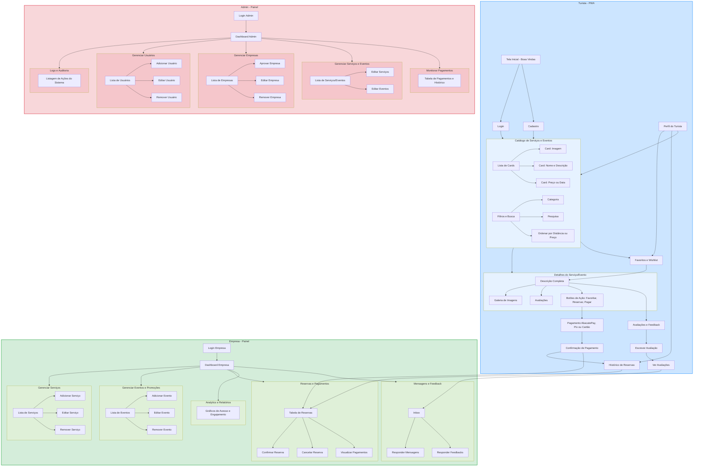

## **1️⃣ UX – Fluxo Geral**

### **Turista (PWA – Mobile)**

1. **Tela Inicial / Onboarding**
    
    - Botões: “Login”, “Cadastro”
        
    - Opção de idioma
        
    - Breve introdução: “Descubra empresas, serviços e eventos em Barra Bonita”
        
2. **Cadastro / Login**
    
    - Formulário com campos:
        
        - Nome, Email, Senha, Idioma
            
        - Botão “Cadastrar”
            
    - Login: Email + Senha
        
    - Recuperação de senha
        
3. **Tela Principal / Catálogo**
    
    - Lista de empresas e serviços
        
    - Filtros: Categoria, Preço, Localização
        
    - Botão de busca
        
    - Cards de serviço com: Nome, Foto, Preço, Distância, Avaliação média
        
4. **Detalhes do Serviço**
    
    - Foto, descrição detalhada
        
    - Botão: “Favoritar”
        
    - Botão: “Reservar / Pagar”
        
    - Avaliações e comentários
        
5. **Favoritos**
    
    - Lista de serviços/empresas favoritados
        
    - Botão para remover
        
    - Acesso rápido ao detalhe de cada serviço
        
6. **Reservas e Pagamentos**
    
    - Seleção de data/hora
        
    - Escolha do método de pagamento (AbacatePay / Pix / Cartão)
        
    - Confirmação e histórico
        
7. **Eventos / Promoções**
    
    - Lista de eventos ativos
        
    - Filtros por data ou categoria
        
    - Notificações de promoções
        
8. **Perfil**
    
    - Visualização e edição de dados
        
    - Histórico de reservas
        
    - Configuração de idioma, notificações
        

---

### **Empresa (Painel Desktop / Tablet)**

1. **Login**
    
    - Email + Senha
        
    - Redireciona para painel da empresa
        
2. **Dashboard**
    
    - Resumo de serviços cadastrados, reservas e pagamentos
        
    - Alertas de novas reservas ou mensagens
        
3. **Gerenciamento de Serviços / Eventos**
    
    - Lista de serviços/eventos
        
    - Botões: Adicionar, Editar, Remover
        
    - Upload de imagens e descrição
        
    - Status de visibilidade
        
4. **Reservas e Pagamentos**
    
    - Lista de reservas feitas
        
    - Status: pendente, confirmado, cancelado
        
    - Histórico de pagamentos com filtro por período
        
5. **Mensagens / Notificações**
    
    - Receber mensagens de turistas
        
    - Responder feedbacks
        
    - Notificações de novas reservas
        
6. **Analytics / Relatórios**
    
    - Métricas de acesso, reservas e engajamento
        
    - Gráficos: Favoritos, Visualizações, Pagamentos
        

---

### **Admin**

1. **Login Admin**
    
    - Email + Senha
        
    - Painel central de administração
        
2. **Dashboard**
    
    - Visualização geral: usuários, empresas, pagamentos
        
    - Alertas de cadastros pendentes
        
3. **Gerenciamento**
    
    - CRUD completo: Usuários, Empresas, Serviços, Eventos
        
    - Aprovação de novos cadastros
        
    - Logs de ações (audit trail)

---

### Wire Frames




---

```mermaid
```