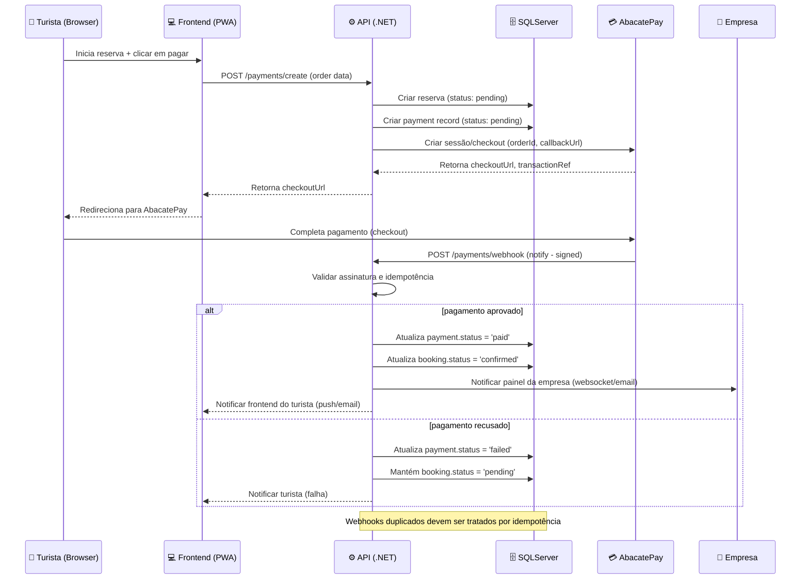

## 🎯 Objetivo

Permitir que turistas e clientes realizem pagamentos de serviços e reservas de forma **rápida, segura e integrada** com o sistema, utilizando a **AbacatePay**.  
O módulo deve registrar transações, atualizar automaticamente reservas e enviar notificações para usuários e empresas.

---

## 🧩 Fluxo Geral de Pagamento

**Descrição do fluxo:**

1. O cliente seleciona o serviço ou tour e inicia a reserva.
    
2. O sistema cria uma **ordem de pagamento** contendo valor, descrição, cliente e moeda.
    
3. O cliente é redirecionado para o **checkout seguro da AbacatePay**.
    
4. Após a transação, a AbacatePay envia um **webhook de confirmação** para o backend.
    
5. O backend atualiza o status do pagamento e da reserva automaticamente.
    
6. Cliente e empresa recebem notificações sobre a confirmação ou falha do pagamento.

---

## 🔑 Funcionalidades Principais

- **Criação de ordens de pagamento**
    
    - Valor, descrição, moeda, referência do cliente/serviço.
        
- **Redirecionamento seguro para checkout**
    
    - Evita exposição de dados sensíveis.
        
- **Confirmação automática via webhooks**
    
    - Atualiza reservas e pagamentos sem intervenção manual.
        
- **Suporte a múltiplos métodos de pagamento**
    
    - Pix, cartão de crédito, boleto (dependendo da AbacatePay).
        
- **Logs de transações para auditoria**
    
    - Registro completo para rastreabilidade e compliance.
        
- **Notificações em tempo real**
    
    - E-mail ou push para clientes e empresas.
