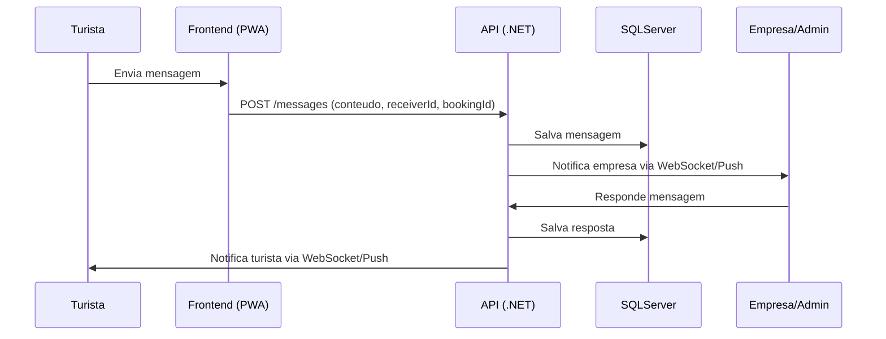

### 🎯 Objetivo

Permitir comunicação **direta e em tempo real** entre turistas e empresas, além de enviar notificações automáticas sobre reservas, pagamentos e eventos.

---

### 🧩 Funcionalidades principais

1. **Mensagens diretas (Chat)**
    
    - Turistas podem enviar dúvidas para empresas.
        
    - Empresas podem responder diretamente pelo painel.
        
    - Suporte a texto, links, emojis.
        
2. **Notificações automáticas**
    
    - Alertas sobre reservas confirmadas ou canceladas.
        
    - Pagamentos aprovados ou falhados.
        
    - Lembretes de eventos próximos.
        
    - Avisos de promoções e cupons.
        
3. **Histórico de mensagens**
    
    - Todas as mensagens ficam registradas no banco.
        
    - Permitindo auditoria e consulta futura.
        
4. **Websockets / SignalR**
    
    - Atualização em tempo real do chat e notificações.
        
    - Push notifications no PWA para alertas importantes.
        
5. **Mensagens de sistema**
    
    - Mensagens automáticas sobre status de reserva/pagamento.
        
    - Ex.: “Sua reserva do passeio X foi confirmada.”

### 🧩 Fluxo de Mensageria

