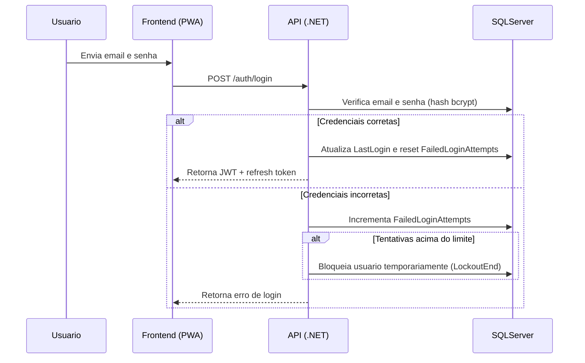

### 🎯 Objetivo

Garantir que **usuários, empresas e administradores** tenham seus dados protegidos, prevenindo acesso não autorizado, fraudes e vazamento de informações sensíveis.

---

### 🔑 Funcionalidades e boas práticas

1. **Autenticação e Autorização**
    
    - **JWT (JSON Web Tokens)** para autenticação de API.
        
    - Tokens de acesso com tempo limitado (ex.: 15 min) + refresh token.
        
    - Controle de acesso baseado em **roles**: `Tourist`, `Company`, `Admin`.
        
    - Senhas armazenadas com **hashing seguro** (ex.: `bcrypt`).
        
2. **Proteção de endpoints**
    
    - Middleware para validar token JWT em todas rotas protegidas.
        
    - Permissões granular por recurso (ex.: só o dono da reserva pode ver detalhes).
        
3. **Criptografia de dados sensíveis**
    
    - Dados de pagamento não armazenados localmente.
        
    - Informações pessoais sensíveis podem ser **criptografadas no banco**.
        
4. **Segurança no frontend (Angular/PWA)**
    
    - Armazenamento seguro de tokens (ex.: `HttpOnly cookies` ou `sessionStorage` com cuidado).
        
    - Evitar exposição de informações sensíveis no DOM ou localStorage.
        
    - HTTPS obrigatório em todas requisições.
        
5. **Proteção contra ataques comuns**
    
    - **CSRF**: tokens em formulários ou cabeçalhos.
        
    - **XSS**: sanitização de entradas do usuário.
        
    - **SQL Injection**: uso de queries parametrizadas no SQL Server.
        
    - **Rate Limiting / Throttling**: proteger endpoints críticos (login, pagamento, webhook).
        
6. **Auditoria e logs**
    
    - Tabela `Logs` já existente registra ações importantes.
        
    - Alertas automáticos para acessos suspeitos.
        
7. **Segurança de pagamentos**
    
    - Checkout seguro via AbacatePay.
        
    - Não armazenar números de cartão.
        
    - Webhooks assinados e validados para idempotência.

---

### 🗄️ Estrutura de segurança no banco de dados

Já incluída parcialmente com a tabela `Users` e `Logs`:

```sql
-- Exemplo de colunas para reforço de segurança
ALTER TABLE Users
ADD LastLogin DATETIME2 NULL,
    FailedLoginAttempts INT DEFAULT 0,
    LockoutEnd DATETIME2 NULL;
```
- **LastLogin**: para monitorar atividade suspeita.
    
- **FailedLoginAttempts** e **LockoutEnd**: bloquear temporariamente após múltiplas tentativas falhas.

---

### 🧩 Fluxo de login seguro


