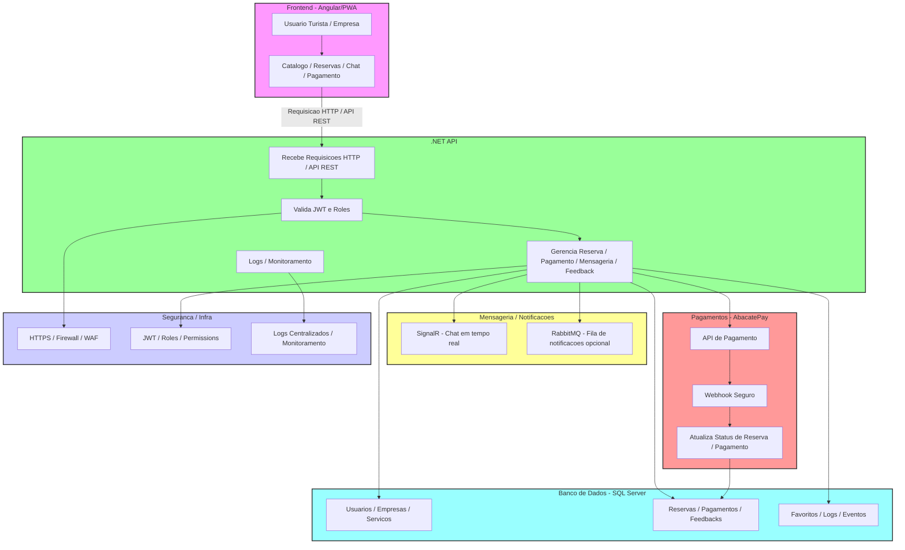

### 🎯 Objetivo

Garantir que o sistema esteja **disponível, escalável e seguro**, com ambientes separados para **desenvolvimento, homologação e produção**.

---

```mermaid
graph TD
    %% ---------------------------
    %% Frontend
    %% ---------------------------
    subgraph Frontend [Frontend - Angular/PWA]
        direction TB
        FE1[Usuario Turista / Empresa]
        FE2[Catalogo / Reservas / Chat / Pagamento]
    end
    style Frontend fill:#f9f,stroke:#333,stroke-width:2px

    %% ---------------------------
    %% Backend
    %% ---------------------------
    subgraph Backend [.NET API]
        direction TB
        BE1[Recebe Requisicoes HTTP / API REST]
        BE2[Valida JWT e Roles]
        BE3[Gerencia Reserva / Pagamento / Mensageria / Feedback]
        BE4[Logs / Monitoramento]
    end
    style Backend fill:#9f9,stroke:#333,stroke-width:2px

    %% ---------------------------
    %% Banco de Dados
    %% ---------------------------
    subgraph DB [Banco de Dados - SQL Server]
        direction TB
        DB1[Usuarios / Empresas / Servicos]
        DB2[Reservas / Pagamentos / Feedbacks]
        DB3[Favoritos / Logs / Eventos]
    end
    style DB fill:#9ff,stroke:#333,stroke-width:2px

    %% ---------------------------
    %% Mensageria
    %% ---------------------------
    subgraph Msg [Mensageria / Notificacoes]
        direction TB
        M1[SignalR - Chat em tempo real]
        M2[RabbitMQ - Fila de notificacoes opcional]
    end
    style Msg fill:#ff9,stroke:#333,stroke-width:2px

    %% ---------------------------
    %% Pagamentos
    %% ---------------------------
    subgraph Payment [Pagamentos - AbacatePay]
        direction TB
        P1[API de Pagamento]
        P2[Webhook Seguro]
        P3[Atualiza Status de Reserva / Pagamento]
    end
    style Payment fill:#f99,stroke:#333,stroke-width:2px

    %% ---------------------------
    %% Seguranca
    %% ---------------------------
    subgraph Security [Seguranca / Infra]
        direction TB
        S1[HTTPS / Firewall / WAF]
        S2[JWT / Roles / Permissions]
        S3[Logs Centralizados / Monitoramento]
    end
    style Security fill:#ccf,stroke:#333,stroke-width:2px

    %% ---------------------------
    %% Fluxo de dados
    %% ---------------------------
    FE1 --> FE2
    FE2 -->|Requisicao HTTP / API REST| BE1
    BE1 --> BE2
    BE2 --> BE3
    BE3 --> DB1
    BE3 --> DB2
    BE3 --> DB3
    BE3 --> M1
    BE3 --> M2
    BE3 --> P1
    P1 --> P2 --> P3 --> DB2
    BE3 --> S2
    BE2 --> S1
    BE4 --> S3

```