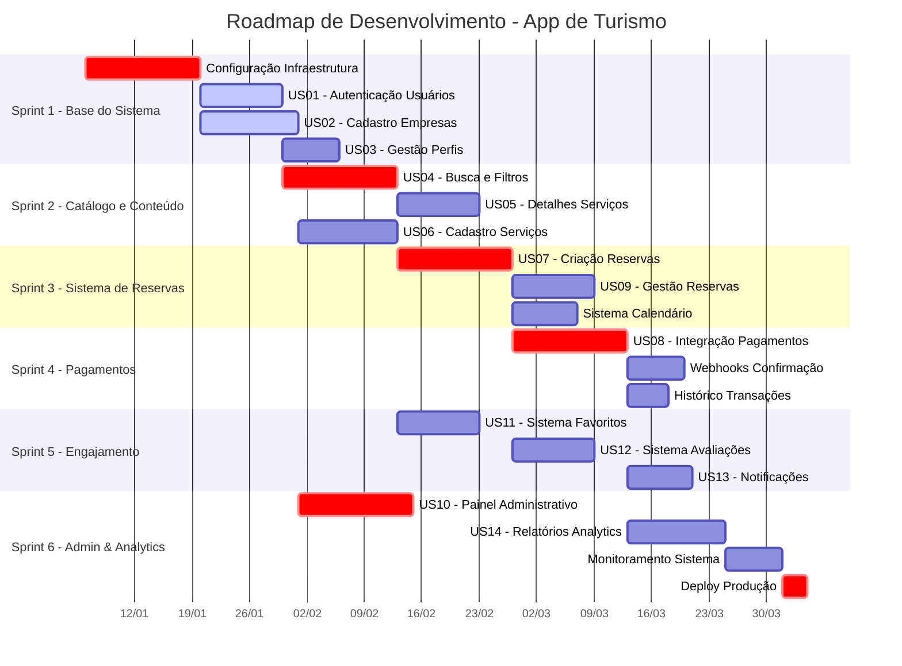

## 🗓️ Planejamento de Sprints (2 semanas cada)

### Sprint 1: Base do Sistema - Autenticação e Perfis

**Duração:** 2 semanas  
**Objetivo:** Estabelecer fundamentos de autenticação e gestão de usuários

- US01: Cadastro e autenticação de usuários
    
- US02: Cadastro e aprovação de empresas
    
- US03: Gestão de perfis de usuário
    
- Configuração inicial do projeto e infraestrutura
    

### Sprint 2: Catálogo e Conteúdo

**Duração:** 2 semanas  
**Objetivo:** Implementar sistema de catálogo e gestão de conteúdo

- US04: Sistema de busca e filtros
    
- US05: Detalhamento de serviços
    
- US06: Cadastro de serviços por empresas
    
- Integração com armazenamento de imagens
    

### Sprint 3: Sistema de Reservas

**Duração:** 2 semanas  
**Objetivo:** Implementar fluxo completo de reservas

- US07: Criação de reservas
    
- US09: Gestão de reservas para empresas
    
- Sistema de calendário e disponibilidade
    
- Notificações de novas reservas
    

### Sprint 4: Pagamentos e Transações

**Duração:** 2 semanas  
**Objetivo:** Implementar sistema de pagamentos seguro

- US08: Integração com gateway de pagamento
    
- Sistema de webhooks para confirmações
    
- Gestão de status de pagamentos
    
- Histórico transacional
    

### Sprint 5: Funcionalidades de Engajamento

**Duração:** 2 semanas  
**Objetivo:** Adicionar features de interação e retenção

- US11: Sistema de favoritos
    
- US12: Sistema de avaliações
    
- US13: Sistema de notificações
    
- Otimizações de performance
    

### Sprint 6: Administração e Analytics

**Duração:** 2 semanas  
**Objetivo:** Implementar painéis de gestão e analytics

- US10: Painel administrativo completo
    
- US14: Sistema de relatórios
    
- Monitoramento e logs
    
- Preparação para deploy em produção

---

## 🎯 Metas por Sprint:

1. **Sprint 1**: Sistema de autenticação funcional com perfis básicos
    
2. **Sprint 2**: Catálogo de serviços navegável e sistema de gestão de conteúdo
    
3. **Sprint 3**: Fluxo completo de reservas com calendário integrado
    
4. **Sprint 4**: Sistema de pagamentos seguro e confiável
    
5. **Sprint 5**: Features de engajamento para aumentar retenção
    
6. **Sprint 6**: Ferramentas de gestão e preparação para escala

---

---

## 📋 Legenda do Gantt:

- **Crit** (Crítico): Tarefas essenciais para o fluxo principal
    
- **Barras sólidas**: Desenvolvimento ativo
    
- **Setas**: Dependências entre tarefas
    
- **Duração**: 2 semanas por sprint com margem para imprevisto