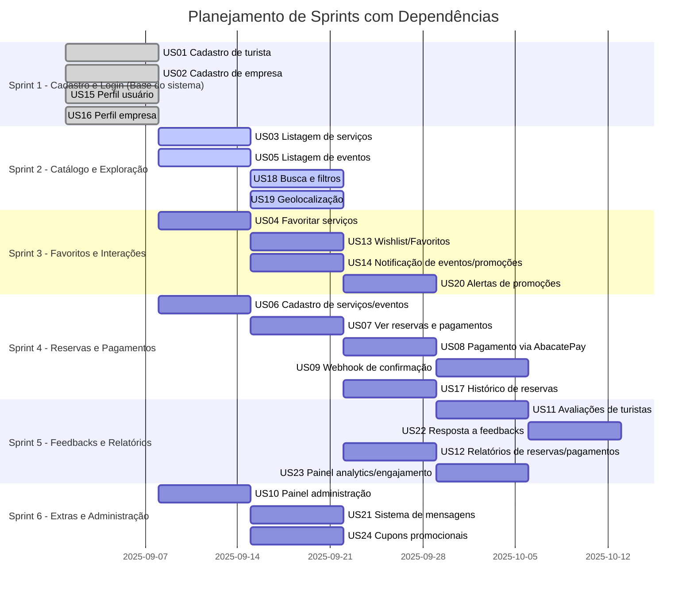

## 📌 Planejamento de Sprints (1 semana cada)

### 🟣 Sprint 1 – Autenticação e Cadastro de Usuários

**Objetivo:** Garantir que usuários possam se cadastrar e acessar a plataforma com segurança.  
**UCs:** UC-01 (Cadastro de Usuário), UC-02 (Login), UC-04 (Recuperação de Senha).  
**Infra/DevOps:**

- Configurar banco de dados inicial (SQL Server).
    
- Configurar autenticação JWT.
    
- Deploy básico no ambiente de staging.  
    **Entregáveis:**  
    ✅ Login, cadastro e recuperação de senha funcionais  
    ✅ Base do sistema online (backend + banco + frontend inicial)
    

---

### 🟣 Sprint 2 – Catálogo de Empresas

**Objetivo:** Criar o diretório de empresas para navegação pelos usuários.  
**UCs:** UC-06 (Cadastro de Empresa), UC-07 (Listar Empresas), UC-08 (Detalhes da Empresa).  
**Infra/DevOps:**

- Ajustar storage de imagens (logo das empresas).
    
- Deploy incremental.  
    **Entregáveis:**  
    ✅ Empresas cadastradas no sistema  
    ✅ Listagem e busca básica por empresas  
    ✅ Página de detalhes com informações principais
    

---

### 🟣 Sprint 3 – Promoções e Interações

**Objetivo:** Permitir que empresas publiquem promoções e usuários interajam.  
**UCs:** UC-11 (Publicar Promoção), UC-12 (Listar Promoções), UC-14 (Curtir/Salvar Promoções), UC-26 (Seguir Empresa), UC-27 (Notificações).  
**Infra/DevOps:**

- Configurar fila de notificações (opcional, se houver push/email).
    
- Deploy com atualizações de APIs.  
    **Entregáveis:**  
    ✅ Empresas publicam promoções  
    ✅ Usuários veem lista de promoções  
    ✅ Sistema de likes/salvos  
    ✅ Seguir empresa e receber notificações
    

---

### 🟣 Sprint 4 – Avaliações e Feedback

**Objetivo:** Criar a parte de avaliações e reputação de empresas.  
**UCs:** UC-16 (Avaliar Empresa), UC-17 (Ver Avaliações), UC-19 (Excluir/Editar Avaliação).  
**Infra/DevOps:**

- Configuração de permissões de usuários (apenas quem consumiu serviço pode avaliar).  
    **Entregáveis:**  
    ✅ Usuários avaliam empresas  
    ✅ Empresas podem ver feedback  
    ✅ Moderar avaliações (editar/excluir pelo autor)
    

---

### 🟣 Sprint 5 – Painéis e Estatísticas

**Objetivo:** Criar dashboards para empresas acompanharem engajamento.  
**UCs:** UC-21 (Visualizar Estatísticas), UC-22 (Relatórios de Promoções), UC-23 (Engajamento de Usuários), UC-24 (Métricas de Avaliações).  
**Infra/DevOps:**

- Preparar queries otimizadas para relatórios.
    
- Deploy com dashboards integrados.  
    **Entregáveis:**  
    ✅ Painel com estatísticas básicas  
    ✅ Relatório de promoções ativas  
    ✅ Engajamento de usuários por promoções  
    ✅ Métricas de avaliações
    

---

### 🟣 Sprint 6 – Funcionalidades Extras

**Objetivo:** Entregar funcionalidades adicionais e polimento.  
**UCs:** UC-13 (Compartilhar Promoção), UC-28 (Recomendações de Promoções), UC-29 (Sugestão de Empresas).  
**Infra/DevOps:**

- Otimizações de performance.
    
- Deploy em ambiente de produção com CI/CD completo.  
    **Entregáveis:**  
    ✅ Compartilhar promoções em redes sociais  
    ✅ Recomendação personalizada de promoções  
    ✅ Sugestão de empresas relevantes

---

